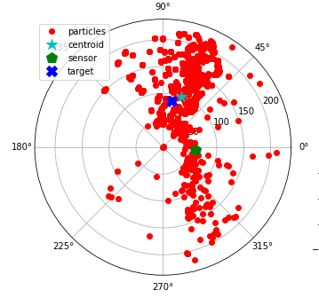

# BirdsEye
### Localizing Radio Frequency Targets Using Reinforcement Learning


## Installation 

```
pip install -r requirements.txt
```

## Usage
### To Run
```
$ python run_birdseye.py -h 
usage: run_birdseye.py [-h] -c FILE [-b]

optional arguments:
  -h, --help            show this help message and exit
  -c FILE, --config FILE
                        Specify a configuration file
  -b, --batch           Perform batch run
```
### Configurations 
See [Configurations Documentation](CONFIGS.md) for more information. 


## Examples
### Run with Monte Carlo Tree Search policy
```
$ python run_birdseye.py -c configs/mcts.yaml 
```
### Run with Deep Q-Network policy 
```
$ python run_birdseye.py -c configs/dqn.yaml 
```

___


> Deep Q-Network architecture

    
