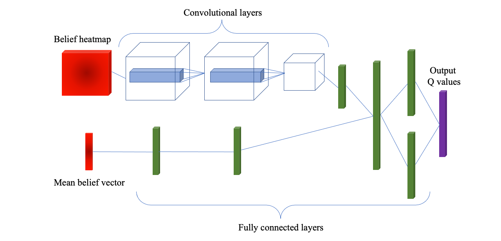

# BirdsEye

### Localizing Radio Frequency Targets Using Reinforcement Learning
The BirdsEye project demonstrates the simulated
tracking of radio frequency (RF) signals via
reinforcement learning (RL) techniques implemented
on low-fidelity sensors.
This permits training and inference without the need
for significant compute hardware such as graphical
processing units (GPU).
Instead, these methods can
be run on low-cost, commercial-off-the-shelf
technology, providing capabilities to applications in
which low-cost sensors are paramount in
deployment, or where more sensitive sensors do not
function or cannot be installed due to the nature of
the environment.

This repository is the official implementation of the following work [Tindall et al., 2023](https://ieeexplore.ieee.org/abstract/document/10107397) and [Tindall et al., 2021](https://doi.org/10.1109/ROSE52750.2021.9611756):
> L. Tindall, E. Mair and T. Q. Nguyen, "Radio Frequency Signal Strength Based Multitarget Tracking With Robust Path Planning," in IEEE Access, vol. 11, pp. 43472-43484, 2023, doi: 10.1109/ACCESS.2023.3269758.

> L. Tindall, Z. Hampel-Arias, J. Goldfrank, E. Mair and T. Q. Nguven, "Localizing Radio Frequency Targets Using Reinforcement Learning," 2021 IEEE International Symposium on Robotic and Sensors Environments (ROSE), 2021, pp. 1-7, doi: 10.1109/ROSE52750.2021.9611756.


### Methods
BirdsEye has implemented two statistical methods which drive how the sensor adaptively
tracks an observed target signal: Monte Carlo Tree Search (MCTS) and Deep Q-Learning
(DQN). While each method has advantages over the other, neither requires heavy
compute resources such as a GPU. The MCTS method performs a stochastic search and
selection of the actions available to the sensor, identifying the decision which maximizes
the return on localization rewards. The DQN method is a reinforcement learning algorithm
which can adapt to large decision spaces using neural networks, with major public
successes such as [DeepMind’s AlphaGo](https://deepmind.com/research/case-studies/alphago-the-story-so-far).

<p align="center">
   <br>
  <em align = "center"><b>Fig. 1: State estimation and motion planning</b></em>
</p>

___

<p align="center">
  
  <em align = "center"><b>Fig. 2: Deep Q-Network architecture for motion planning</b></em>
</p>

## Contents
1. [Usage](#1-usage)
2. [Configurations](#2-configurations)
3. [Examples](#3-examples)
4. [Results](#4-results)
5. [Descriptions](#5-descriptions)

## 1. Usage
### Installation
```
poetry config virtualenvs.create false 
poetry install --no-root
```

### To run on command line
```
$ python geolocate.py -h
usage: geolocate.py [-h] [--log LOG] config_path

positional arguments:
  config_path  Path to config file, geolocate.ini provided as example.

options:
  -h, --help   show this help message and exit
  --log LOG    Log level
```

### To run using a Docker container
First install Docker. [Instructions here.](https://docs.docker.com/engine/install/)

A [Dockerfile](Dockerfile) has been provided for ease of use. To run with Docker, execute the following commands:
```
docker build -t birds_eye .
docker run -it -p 4999:4999 birds_eye
```

A Docker compose file has also been provided. To run with docker compose:
```
ORCHESTRATOR={INSERT ORCHESTRATOR IP} docker compose -f geolocate.yml up
```


## 2. Configurations
Running experiments requires a set of configurations variables which specify settings for the envrionment and motion planning method.
See [Configurations Documentation](docs/CONFIGS.md) for more information.


## 3. Examples
```
$ python geolocate.py geolocate.ini
```


## 4. Results
The results of the experiments will be stored in the `./runs` directory.
Log files are created which store the configurations for each experiment along with metrics and state information per time step.
For a detailed guide and visualizations please see results user guide notebook: [results_guide.ipynb](results_guide.ipynb).

<p align="center">
  
  <em align = "center"><b>Fig. 3: Localization results (distance between mean belief and actual target location)</b></em>
</p>

<p align="center">
  
  <em align = "center"><b>Fig. 4: Inference times and speed comparison</b></em>
</p>


## 5. Descriptions
All code for training and evaluation in simulation is contained in the [birdseye](birdseye) directory.
The [birdseye](birdseye) directory contains some important base classes which can be extended to offer customizability to a specific use case. We provide a few subclasses to get started.

### [Sensor](birdseye/sensor.py)
The Sensor class defines the observation model for the simulated sensor. Users must define methods for sampling an observation given a state and for determining the likelihood of an observation given a state. We have provided example subclasses for an omni-directional signal strength setup and a bearing based directional setup.

### [Actions](birdseye/actions.py)
The Actions class defines the action space for the sensor. For computational simplicity, actions are discretized.

### [State](birdseye/state.py)
The State class includes methods for updating the state variables of the environment. This includes states for both the sensor and target. Motion dynamics and reward functions are defined within this class. We have included example reward functions based on an entropy/collision tradeoff as well as a range based reward.

### [RFEnv](birdseye/env.py)
The RFEnv class is a Gym-like class for controlling the entire pipeline of the simulation.
