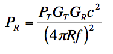
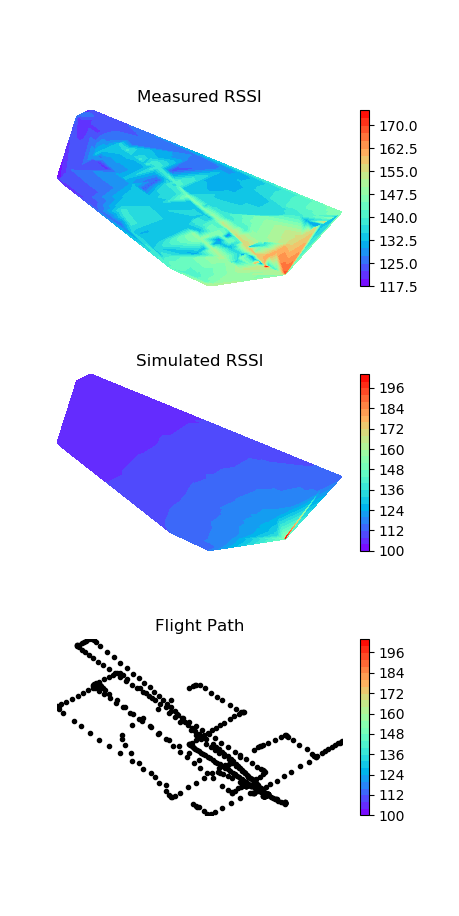

## BirdsEye - RF Simulation

To facilitate the validation of the BirdsEye Reinforced Learning (RL) and other AI-based algorithms, we simulated signal stength as a function of controller and observer positon. We used a simple free-space attenuation equation based on the Friis transmission formula for signal propagation. This along with GPS latitude and longitude position coordinates, we are able to estimate the recieved signal strength indication level (RSSI) as a funciton of position in 2D. Note that this is a very simple model and does not include more sophiosticated effects such as doppler, multi-path and other impairments. 

  

Where:  

Gr = receive antenna gain (dB), Gt = transmit antenna gain (dB), Pt = transmitted power (dBm)
        f = frequency (Hz), C = speed of light (m/s), R = distance in feet, Pr = received power (dBm)
        

In this directory is a python script (simrssi.py) used to calculate RSSI values based on lat/lon input coordinates. These are plotted using one of two plotting scripts: plot-lin.py or plot-cub.py which use either linear or cubic interpolation for generating a heat-map of RF signal strength. Examples are shown below:

  

### References

1. https://www.antenna-theory.com/basics/friis.php
2. https://en.wikipedia.org/wiki/Friis_transmission_equation

